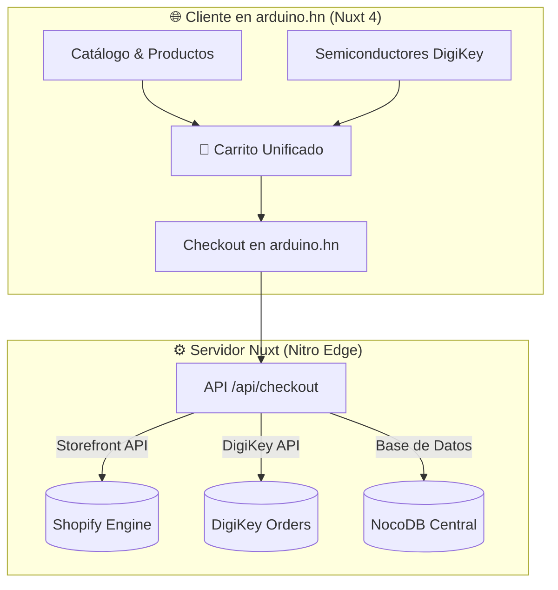

# 📘 Guía de Integración Headless: Shopify, DigiKey y Modo de Pruebas

Este documento detalla la arquitectura, el flujo del carrito unificado y el procedimiento seguro para realizar pruebas en **Shopify** y **DigiKey** sin generar cobros reales con tarjetas de crédito.

---

## 1. 🛡️ Modo de Prueba en Shopify (Simulación sin Cobros Reales)

Para realizar pruebas completas de compra sin debitar dinero real:

### A. Activación de la Pasarela de Pruebas (Bogus Gateway)
1. Ingresa a tu panel de **Shopify** ➔ **Configuración** (*Settings*) ➔ **Pagos** (*Payments*).
2. En la sección de proveedores de pago, activa **(for testing) Bogus Gateway** o activa el **Modo de Prueba** (*Test Mode*) de tu pasarela activa.

### B. Tarjetas de Prueba Oficiales de Shopify
Usa las siguientes credenciales en el checkout para simular los diferentes escenarios:

| Campo | Valor a Ingresar | Resultado Simulado |
| :--- | :--- | :--- |
| **Nombre en la tarjeta** | `Bogus Gateway` | Nombre requerido por el simulador |
| **Número de tarjeta** | `1` | ✅ **Aprobado** (Simula pago exitoso) |
| **Número de tarjeta** | `2` | ❌ **Rechazado** (Simula tarjeta declinada) |
| **Número de tarjeta** | `3` | ⚠️ **Error de Pasarela** (Simula fallo de conexión) |
| **Fecha de Expiración** | Cualquier fecha futura (ej. `12/28`) | Válida |
| **Código de Seguridad (CVV)** | `123` | Válido |

> [!TIP]
> Al usar estas tarjetas de prueba, el pedido se registra en Shopify y en NocoDB como un pedido real para verificar stock y facturación, pero **el costo financiero es $0.00**.

---

## 2. 🛍️ Arquitectura Headless Commerce (Ocultar URLs de Shopify)

El cliente **nunca sale del dominio `arduino.hn`** ni visualiza enlaces de `myshopify.com` en su barra de direcciones.



### ¿Cómo se logra el aislamiento de URLs?
1. **Frontend Autónomo:** Toda la interfaz de usuario, páginas de producto, imágenes, carrito y checkout están construidos en **Nuxt**.
2. **Shopify como Motor Silencioso:** Tu servidor Nuxt se comunica con Shopify en segundo plano mediante la **Storefront API / Admin API (GraphQL/REST)** intercambiando solo datos JSON.
3. **El cliente nunca es redirigido:** Toda la experiencia transcurre bajo la marca e identidad visual de **ArduinoHN**.

---

## 3. 🔌 Carrito Unificado (Stock Local + DigiKey)

El cliente puede comprar componentes de ambos orígenes en una sola orden:

1. **Ítems Locales (ArduinoHN):** Sensores, placas de desarrollo, kits escolares y módulos almacenados en tu inventario de Shopify/NocoDB.
2. **Ítems de DigiKey:** Circuitos integrados, microcontroladores y semiconductores obtenidos en tiempo real mediante la API oficial de DigiKey con el margen configurado.
3. **Procesamiento de la Orden:**
   - El backend genera una orden maestra en **NocoDB**.
   - Los productos locales se descuentan del inventario en **Shopify**.
   - Los productos importados de DigiKey quedan registrados con su número de parte (*Part Number*) y proveedor para su posterior consolidación o fulfillment.

---

## 4. 🔑 Credenciales Requeridas en `.env`

Cuando crees tu tienda en Shopify, solo necesitaremos configurar dos variables en tu archivo `.env`:

```env
# Conexión Headless con Shopify
SHOPIFY_DOMAIN=tu-tienda.myshopify.com
SHOPIFY_STOREFRONT_TOKEN=shpat_xxxxxxxxxxxxxxxxxxxxxxxx
```

> [!NOTE]
> El Storefront Token se genera en **Shopify Admin** ➔ **Aplicaciones** ➔ **Desarrollar aplicaciones** ➔ **Crear una app** (permisos de Storefront API).

---
*Documento guardado para referencia continua del proyecto ArduinoHN.*
